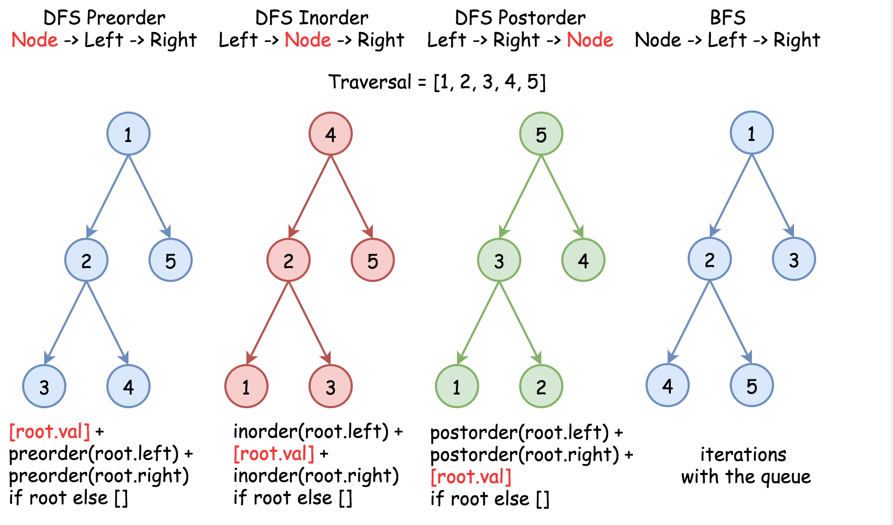

## Traverse
1. Depth First Search (DFS)
    1. preorder 
    2. inorder
    3. postorder

2. Breadth First Search (BFS)


Traversing is normally achieved by using recursion, taking `inorder` as an emample: 
```java
public void traverse(Node node) {
    // left
    if (node.left != null) {
        traverse(node.left);
    }

    // current node
    dosomething

    // right
    if (node.right != null) {
        traverse(node.right);
    }
}
```